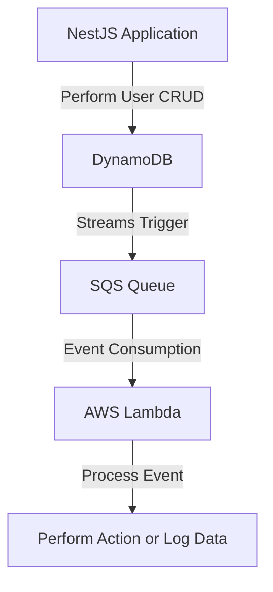

# Project Summary

## Technologies
- [NestJS](https://nestjs.com/)
- [Lambda](https://aws.amazon.com/lambda/)
- [Amazon DynamoDB](https://aws.amazon.com/dynamodb/)
- [Amazon SQS](https://aws.amazon.com/sqs/)
- [Serverless](https://www.serverless.com/)

## Goal
Create a NestJS proof-of-concept application with basic user CRUD operations that store data in Amazon DynamoDB. Implement DynamoDB streams to trigger an event to Amazon SQS, which runs a Lambda function to process the event.

## Architecture

